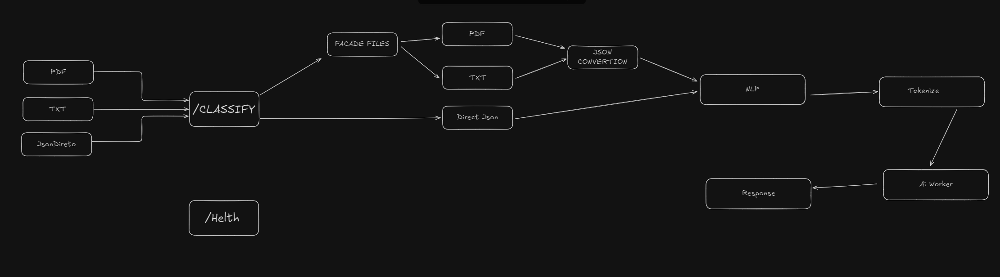
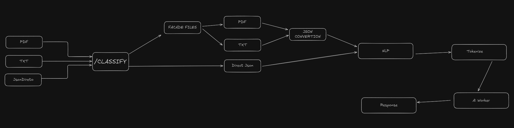
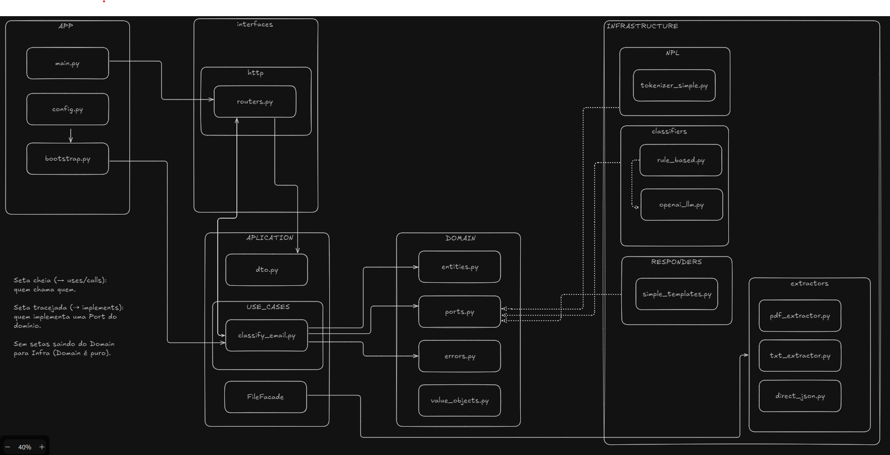
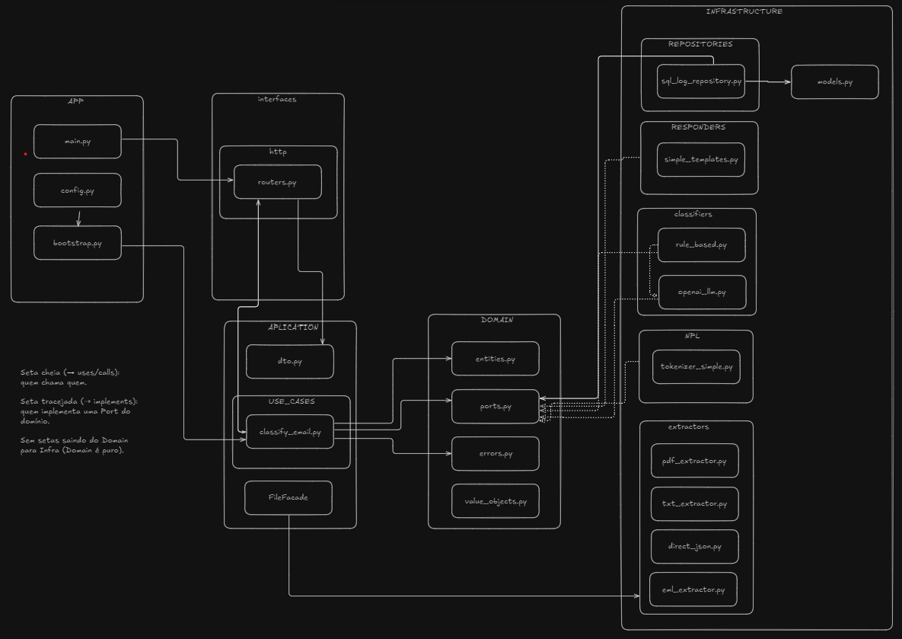
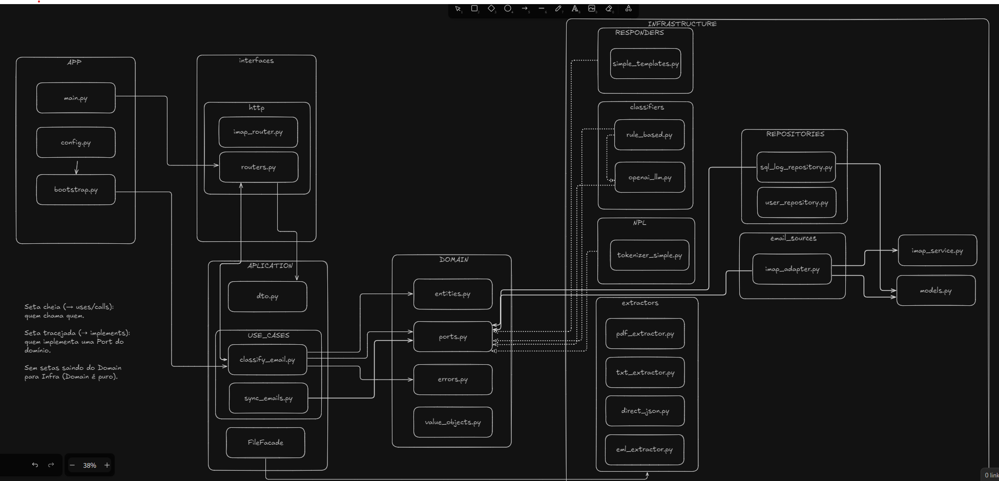

# 📧 Email Classifier — Backend (FastAPI + DDD-lite)

MVP enxuto para **classificação automática de e-mails**.  
Recebe **texto direto**, **arquivos (.pdf / .txt)** ou lê diretamente de uma **caixa de entrada IMAP**,  
classifica o e-mail como **Produtivo** ou **Improdutivo** e gera uma **resposta sugerida**.

Arquitetura **hexagonal** (ports & adapters), com **use cases** independentes e adapters substituíveis.  
Por padrão usa classificador **rule-based**, mas é possível plugar **LLMs** (ex: OpenAI).

---

## ✨ Features

- `POST /classify`  
  Aceita **JSON** ou **multipart** (`.pdf` / `.txt`)
- **Facade de arquivos** (PDF/TXT → texto)
- **NLP simples**: lowercasing, stopwords, tokenização regex
- **Classificação**:
  - 🎯 Rule-based (padrão, sem custo)
  - 🤖 OpenAI LLM (opcional via `OPENAI_API_KEY`)
- **Resposta sugerida** curta e automática
- **Logs** persistidos em SQLite
- **IMAP Service**:
  - `POST /imap/config` → conecta na caixa de entrada
  - `GET /imap/status` → status do serviço
  - `POST /imap/stop` → encerra o worker IMAP
  - Worker em thread (`ImapService`) que classifica periodicamente novos e-mails
- Swagger em `/docs`
- `GET /health` para monitoramento

---

## 📚 Documentação Adicional

Além deste README, o projeto conta com docs extras na pasta [`docs/`](./docs):

- [📌 MVP.md](./docs/MVP.md) → descrição do escopo inicial e objetivos do MVP
- [⚙️ CICD.md](./docs/CICD.md) → anotações sobre pipeline CI/CD
- [📬 BeforeImap.md](./docs/BeforeImap.md) → planejamento e decisões antes da implementação do serviço IMAP
- [📑 logs.md](./docs/logs.md) → detalhes sobre armazenamento e estrutura dos logs

---

---

## 🏗️ Arquitetura Evolutiva

O projeto passou por diferentes estágios de arquitetura.  
Aqui registramos os diagramas e modelagens que mostram como o sistema evoluiu.

### 1. 📐 Modelagem Conceitual (Versão 1)

Primeira modelagem do sistema com foco no fluxo de **NLP simples** antes da integração com IA.



---

### 2. 📐 Modelagem Conceitual (Versão 2 — Revisada)

Ajuste da modelagem para **alinhar o processo de NLP** junto à **IA**, no contexto de **perfis de usuário** (considerando relevância ou não).



---

### 3. 🗂️ Arquitetura Inicial

Arquitetura enxuta apenas com a rota `POST /classify`.



---

### 4. 📨 Arquitetura com IMAP

Evolução com adição da rota `POST /imap/config` e serviço de **worker IMAP** para classificar novos e-mails periodicamente.



---

### 5. 🗃️ Arquitetura com Logs + Repositório SQLite

Versão atual: inclusão da rota `/logs` e do **repositório SQLite**, centralizando persistência dos resultados.



---

## 🏗️ Arquitetura (Visão Lógica)

**Fluxo via IMAP**

1. Front envia `host, user, senha_app, mailbox, profile_id`
2. Backend sobe um **worker (thread)** com `ImapService`
3. Worker chama `SyncEmailsUseCase.run()` periodicamente
4. Cada e-mail:
   - Tokenização → Classificação
   - Log persistido em SQLite
   - Mensagem movida para pasta (`Produtivos` ou `Improdutivos`)

---

## 📁 Estrutura de Pastas

```bash
email_classifier/
app
├── application
│   ├── dto.py
│   └── use_cases
│       ├── classify_email.py
│       └── sync_emails.py
├── auth
│   └── jwt.py
├── bootstrap.py
├── config.py
├── data
│   └── profiles.json
├── domain
│   ├── entities.py
│   ├── errors.py
│   └── ports.py
├── infrastructure
│   ├── classifiers
│   │   ├── openai_llm.py
│   │   ├── rule_based.py
│   │   └── smart_classifier.py
│   ├── db.py
│   ├── email_sources
│   │   ├── imap_adapter.py
│   │   └── imap_service.py
│   ├── extractors
│   │   ├── direct_json.py
│   │   ├── eml_extractor.py
│   │   ├── pdf_extractor.py
│   │   └── txt_extractor.py
│   ├── models.py
│   ├── nlp
│   │   └── tokenizer_simple.py
│   ├── profiles
│   │   └── profile_json.py
│   ├── repositories
│   │   ├── sql_log_repository.py
│   │   └── user_repository.py
│   └── responders
│       └── simple_templates.py
├── interfaces
│   └── http
│       ├── imap_router.py
│       └── routers.py
├── main.py
└── ratelimiting.py

16 directories, 30 files
```

---

## 📦 Dependências

- **fastapi / uvicorn** → API moderna
- **pydantic** → validação
- **sqlalchemy + sqlmodel** → persistência (SQLite)
- **imaplib** → integração IMAP
- **pypdf** → parsing de PDF
- **python-multipart** → upload de arquivos
- **slowapi** → rate limiting

---

## ▶️ Como Rodar (Local)

### 1. Backend

```bash
pip install -r requirements.txt
uvicorn app.main:app --reload
```

### 2. Frontend (Next.js)

```bash
cd email-classifier-frontend
pnpm dev
```

> Defina `NEXT_PUBLIC_API_URL=http://localhost:8000`

---

## 🔌 Endpoints

### Health

`GET /health`

```json
{ "status": "ok" }
```

### Classificação manual

`POST /classify` → via JSON ou upload (`.pdf/.txt`)

### Logs

`GET /logs` → histórico em SQLite

### IMAP

- `POST /imap/config` → inicia serviço IMAP
- `GET /imap/status` → status atual
- `POST /imap/stop` → encerra serviço

---

## 🧪 Exemplo — Iniciar IMAP

```bash
curl -X POST http://127.0.0.1:8000/imap/config   -H "Content-Type: application/json"   -d '{
    "host": "imap.gmail.com",
    "user": "seuemail@gmail.com",
    "password": "senha_app_google",
    "mailbox": "INBOX",
    "profile_id": "default",
    "interval": 10
  }'
```

Resposta:

```json
{
  "status": "imap running",
  "profile_id": "default",
  "host": "imap.gmail.com",
  "mailbox": "INBOX",
  "interval": 10
}
```

---

## 📍 Roadmap Futuro

- Métricas de custo/latência em cada log
- Dashboard web para explorar logs
- Suporte multi-conta IMAP
- Stemming, lematização e multilíngue
- Plug-and-play para outros LLMs

---

## 📜 Licença

MIT — uso livre para protótipos e estudo.
